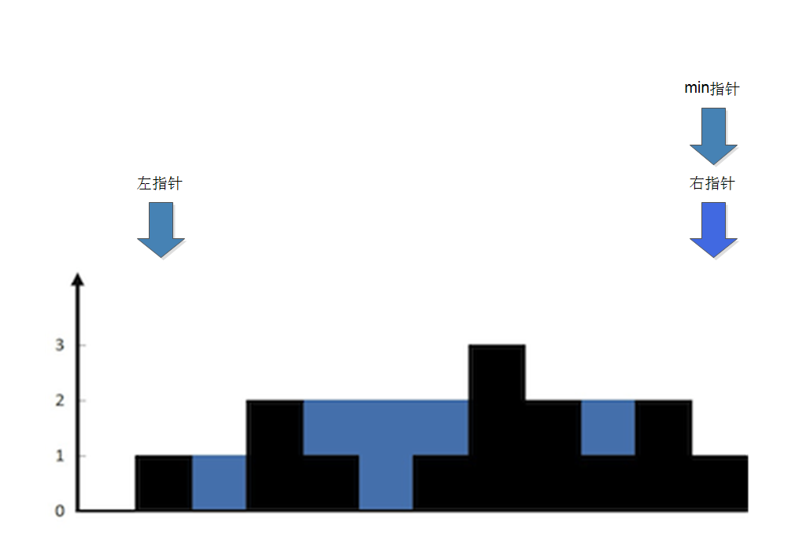

## Description
Given n non-negative integers representing an elevation map where the width of each bar is 1, compute how much water it is able to trap after raining.  
  


The above elevation map is represented by array [0,1,0,2,1,0,1,3,2,1,2,1]. In this case, 6 units of rain water (blue section) are being trapped. Thanks Marcos for contributing this image!

## Example:

Input: [0,1,0,2,1,0,1,3,2,1,2,1]
Output: 6

---
## 思路
* 使用左右边界指针，加入边界最小指针
* 当左指针指向的高度大于等于右指针时，转向移动右指针
* min指针始终记录左右最低边界高度





## 代码
```c++
class Solution {
public:
    int trap(vector<int>& height) {
        if(height.size()<2)return 0;
        int l=0;
        int r=height.size()-1;
        int sum=0;
        int min=height[0]>height[height.size()-1]?height[height.size()-1]:height[0];
        while(l<r){
            while(height[l]<height[r]&&l<r){
                l++;
                if(min>height[l]){
                    sum+=(min-height[l]);
                }else{
                    min=height[l];
                }
            }
            min=height[r];
            while(height[l]>=height[r]&&l<r){
                r--;
                if(min>height[r]){
                    sum+=(min-height[r]);
                }else{
                    min=height[r];
                }
            }
            min=height[l];
            
        }
        
        return sum;
    }
};
```
