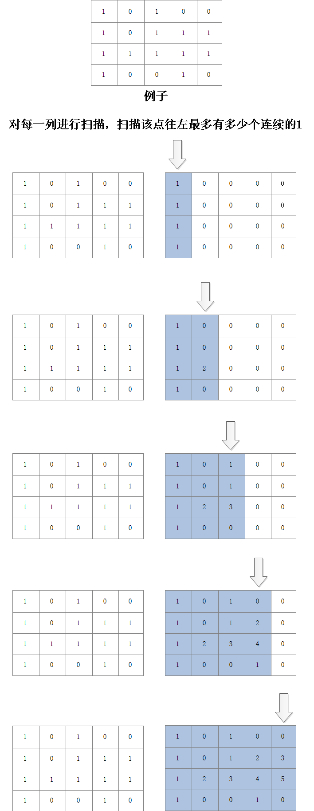
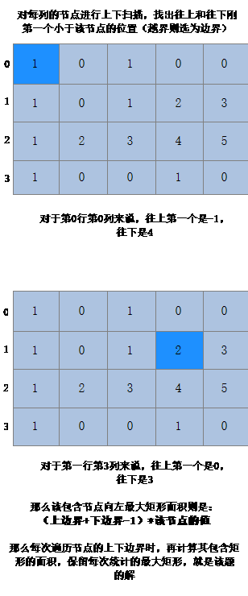

## Description
Given a 2D binary matrix filled with 0's and 1's, find the largest rectangle containing only 1's and return its area.

## Example:
```
Input:
[
  ["1","0","1","0","0"],
  ["1","0","1","1","1"],
  ["1","1","1","1","1"],
  ["1","0","0","1","0"]
]
Output: 6
```

--- 

## 题解




## 代码
```c++

class Solution {
public:
    int maximalRectangle(vector<vector<char>>& matrix) {
        if(matrix.size()<1){
            return 0;
        }
        int max=0;
        int mask[matrix.size()][matrix[0].size()];
        memset(mask,0,sizeof(mask));
        for(int i=0;i<matrix.size();i++){
            int count=0;
            for(int j=0;j<matrix[0].size();j++){
                if(matrix[i][j]=='1'){
                    count++;
                    mask[i][j]=count;
                }else{
                    count=0;
                    mask[i][j]=0;
                }
            }
        }
        
        bool isvisit[matrix.size()][matrix[0].size()];
        memset(isvisit,1,sizeof(isvisit));
        for(int j=0;j<matrix[0].size();j++){
            for(int i=0;i<matrix.size();i++){
                if(!isvisit[i][j]){
                    continue;
                }
                int lpos=i-1;
                int rpos=i+1;
                while(lpos>=0&&mask[lpos][j]>=mask[i][j]){
                    if(mask[lpos][j]==mask[i][j]){
                        isvisit[lpos][j]=false;
                    }
                    lpos--;
                }
                while(rpos<matrix.size()&&mask[rpos][j]>=mask[i][j]){
                    if(mask[rpos][j]==mask[i][j]){
                        isvisit[rpos][j]=false;
                    }
                    rpos++;
                }
                
                int ans=(rpos-lpos-1)*mask[i][j];
                max=max>ans?max:ans;
            }
        }
        
        return max;
    }
};
```