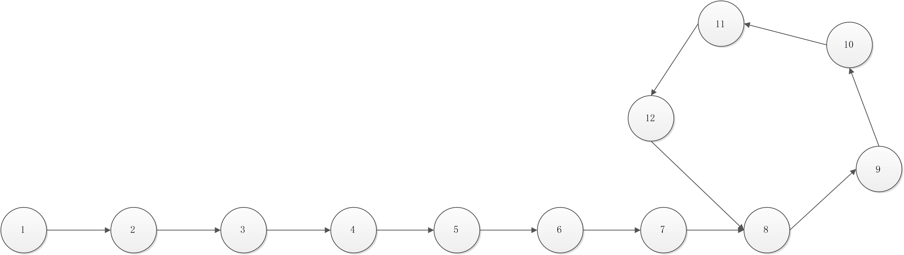
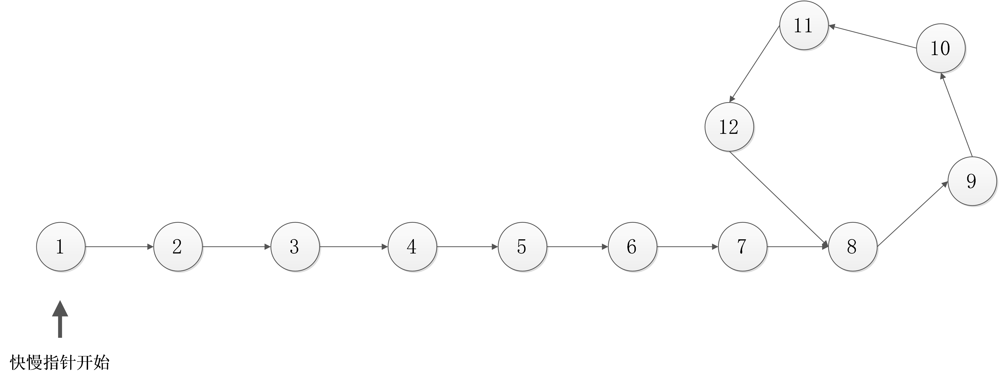
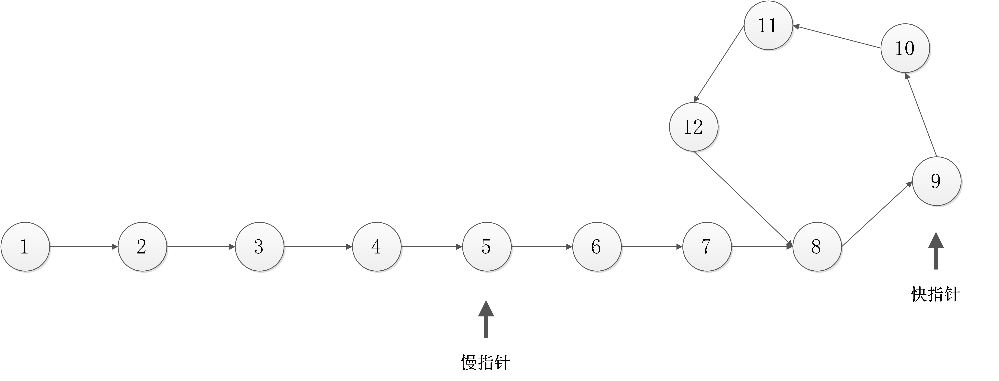
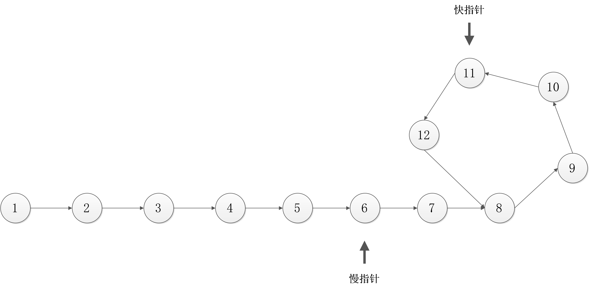
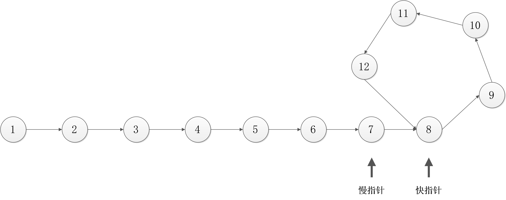
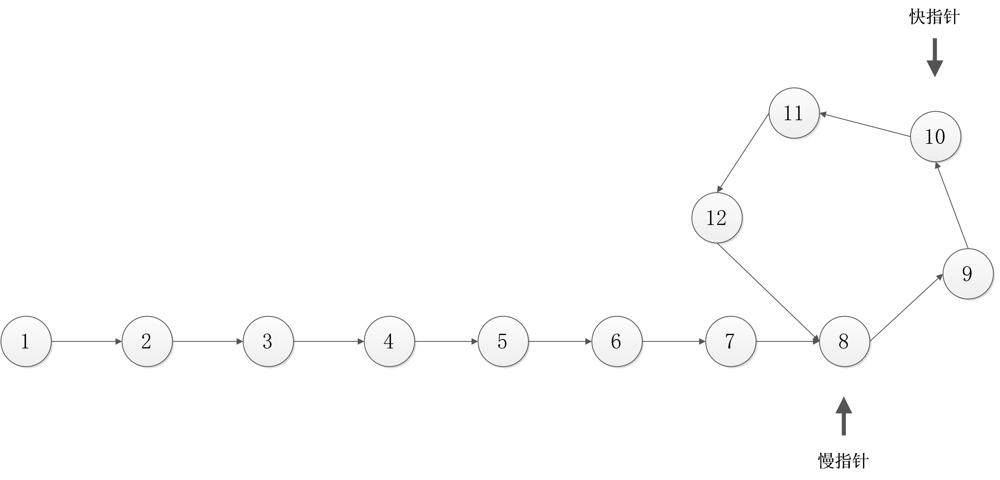
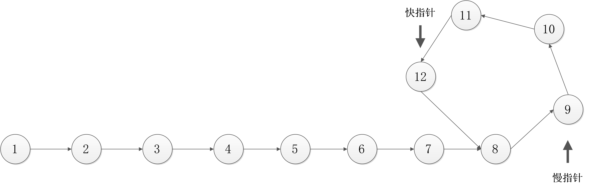
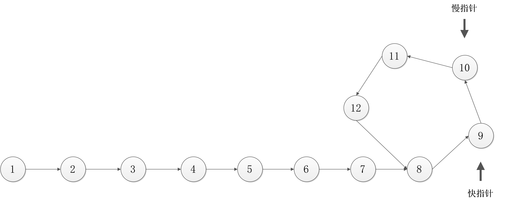
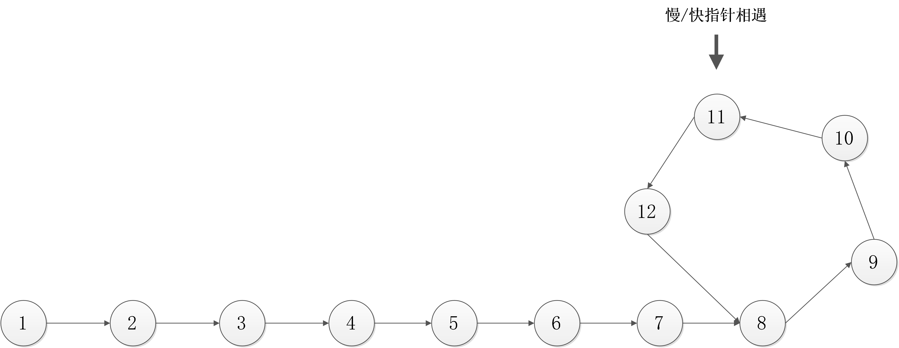
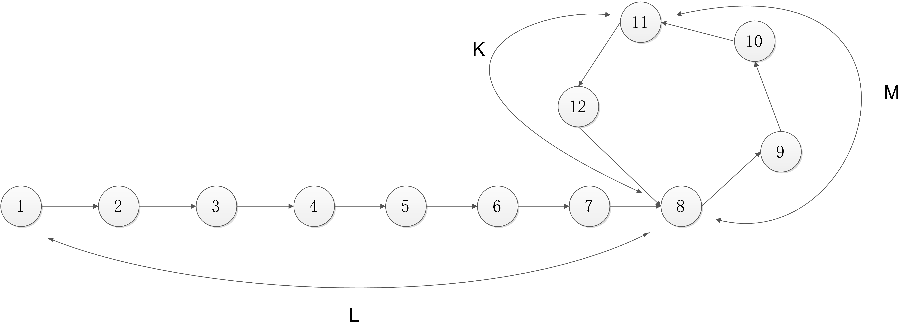

## 题意：给定一个单向链表，求判断该链表是否为带环链表并求出该环的入口点

例如下图，一个带环的单向链表


## 方法一：使用辅助结构Map实现

* 思想：用一个map存储所有链表节点的地址，每次存前判断该节点是否在map中，如果存在，则该链表为带环链表并且该节点为环的入口。
* 优点：简单
* 缺点：需要较大的辅助空间

```c++
#include <iostream>
#include <map>
using namespace std;

struct Node{
        int Val;
        Node* next;
};

Node* Init(){
        int nodeData[]={1,2,3,4,5,6,7,8,9,10,11,12};
        Node* node[12];

        for(int i=0;i<sizeof(node)/sizeof(Node*);i++){
                node[i]=new Node;
                node[i]->Val=nodeData[i];
                cout<<"create node "<<node[i]->Val<<endl;
        }

        for(int i=0;i<sizeof(node)/sizeof(Node*)-1;i++){
                node[i]->next=node[i+1];
        }

        node[sizeof(node)/sizeof(Node*)-1]->next=node[7];

        return node[0];
}

int main(){

        Node* head=Init();
        map<Node*,int> nodeMap;
        while(head){
                if(nodeMap[head]==0){
                        nodeMap[head]=1;
                }else{
                        cout<<"this is a ring list, entrance is: "<<head->Val<<endl;
                        break;
                }
                head=head->next;
        }

        return 0;
}
```
> 输出结果如下
```
create node 1
create node 2
create node 3
create node 4
create node 5
create node 6
create node 7
create node 8
create node 9
create node 10
create node 11
create node 12
this is a ring list, entrance is: 8
```

## 方法二：使用快慢指针
### 判断是否带环
* 思想：分别用一个快指针跟一个慢指针同时从链表头开始移动，快指针的速度是慢指针的两倍，当快慢指针相遇，则该链表为带环链表。
* 优点：不需要大的辅助空间
* 缺点：比较复杂
> 判断带环的步骤










源码实现

### 判断环的入口：分别用两个指针，一个在快慢指针相遇的地方开始移动，一个从链表的头节点开始移动，当这两个指针相遇时，改节点就是环的入口点

> 证明：

* 设从头节点到环入口的距离为L，环的入口按链表顺序到快慢指针相遇的节点的距离为M，快慢指针相遇的节点按链表顺序到环的入口的距离为K，环的周长为P，即P - M = L，如下图所示

* 由于快指针的速度为慢指针的两倍，即S(快)=S(慢)*2
* 由于到两个指针相遇的地点时，快指针比慢指针多走的路程是环的周长的整数倍（快指针追赶慢指针，所以快指针至少比慢指针多走一环的距离），即S(快) - S(慢) = n1 * P (其中n1  >= 1 )，得S(慢) = n1 * P (其中 n1 >= 1)
* 又有S(慢) = L + M + n2 * P (其中 n2 >= 0)，所以 n1 * P = L + M + n2 * P (其中 n1 >= 1 , n2 >= 0)
* 得 (n1 - n2) * P = L + M ，即 (n1 - n2) * P = L + (P - K)，得(n1 - n2 -1) * P + K = L
* 因此从相遇节点按照链表顺序移动L，停下来的位置就是环的入口点

> 求环的入口的步骤


> 快慢指针代码样例
```c++
#include <iostream>
#include <map>
using namespace std;

struct Node{
        int Val;
        Node* next;
};

Node* Init(){
        int nodeData[]={1,2,3,4,5,6,7,8,9,10,11,12};
        Node* node[12];

        for(int i=0;i<sizeof(node)/sizeof(Node*);i++){
                node[i]=new Node;
                node[i]->Val=nodeData[i];
                cout<<"create node "<<node[i]->Val<<endl;
        }

        for(int i=0;i<sizeof(node)/sizeof(Node*)-1;i++){
                node[i]->next=node[i+1];
        }

        node[sizeof(node)/sizeof(Node*)-1]->next=node[7];

        return node[0];
}

int main(){

        Node* head=Init();
        Node* qPos=head;
        Node* sPos=head;
        while(qPos){
                sPos=sPos->next;
                if(!qPos->next){
                        cout<<"this is not a ring list\n";
                        break;
                }
                qPos=qPos->next->next;

                if(sPos==qPos){
                        cout<<"this is a ring list\n";
                        break;
                }
        }

        Node* tPos=head;
        while(true){
                tPos=tPos->next;
                sPos=sPos->next;
                if(tPos==sPos){
                        cout<<"entrance is: "<<sPos->Val<<endl;
                        break;
                }
        }

        return 0;
}
```
结果是
```
create node 1
create node 2
create node 3
create node 4
create node 5
create node 6
create node 7
create node 8
create node 9
create node 10
create node 11
create node 12
this is a ring list
entrance is: 8
```