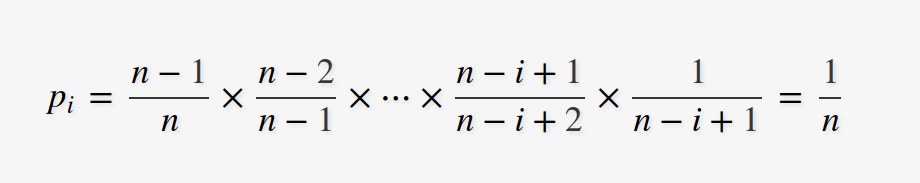

# 洗牌算法

Fisher–Yates shuffle是用于对有限序列随机置换的算法，产生的结果是每个排列的可能性是一样的，也就是说序列中某个元素被分配到每个位置的可能性是一样的。

## Fisher–Yates shuffle原始算法
Fisher–Yates shuffle原始算法的步骤如下：
1. 写下从1到N的数字
2. 从1到未选过数字的数量n之间挑选一个随机数k
3. 将位于序列前面开始第k个未选择的元素输出到新的序列中
4. 继续步骤2直到所有元素都被选过
5. 新的序列就是原始序列的随机排序

### 时间复杂度
O(n^2)

### 代码
```c++
void ShuffleOriginal(int *array, int len)
{
    int newPos;
    int temp;
    bool mask[len];
    int newArray[len];
    int movePos = -1;
    memset(mask, 0, sizeof(mask));
    for (int i = len ; i > 0; i--)
    {
        newPos = (rand() % i)+1;
        int pos = 0;
        movePos=-1;
        while (pos < newPos)
        {
            movePos++;
            if (mask[movePos] == false)
            {
                pos++;
            }
        }
        mask[movePos] = true;
        newArray[i-1] = array[movePos];
    }

    for(int i=0;i<len;i++){
        array[i]=newArray[i];
    }
}
```

数组长度为10的5000000次测试统计结果如下（每一行代表每个元素散落各个位置的次数统计）：
```
500615  499952  499386  500795  500351  499709  499857  499349  501105  498881
500452  499488  498818  499743  499516  501202  498615  500033  500026  502107
500301  500351  500090  500974  499708  499609  500116  499786  500193  498872
499289  500363  500851  498528  499877  500243  500888  500124  500146  499691
499897  500459  499878  499256  500657  500270  500140  499611  499026  500806
499366  500204  500628  500118  499891  499173  500273  499893  499671  500783
499615  500372  499673  500288  500217  499600  500635  500658  499514  499428
500217  499792  500287  499879  498955  500273  499510  500427  501187  499473
500317  499911  500070  500204  500861  499790  499568  500481  499326  499472
499931  499108  500319  500215  499967  500131  500398  499638  499806  500487
```

## 现代版算法
* 从序列1到N中取随机数n
* 将序列的第N位与第n位的数进行交换
* 序列长度N变为N-1,继续步骤1,直至N为1

### 时间复杂度
O(n)

### 等概率证明
* 当某个元素被放置位置第i个位置时，也就是之前的位置没有选到他，并在第i个位置刚好选到他  
* 某个元素被放置位置第i个位置的概率为：  

* 因此每个元素被分配到每个位置的可能性是一样的

### 代码
```c++
void ModernShuffle(int *array, int len)
{
    int newPos;
    int temp;
    for (int i = len - 1; i > 0; i--)
    {
        newPos = rand() % (i + 1);
        temp = array[i];
        array[i] = array[newPos];
        array[newPos] = temp;
    }
}
```
数组长度为10的5000000次测试统计结果如下（每一行代表每个元素散落各个位置的次数统计）：
```
500411  500495  499267  500316  500200  499850  499725  498643  500952  500141
499717  499325  499939  500295  499775  500410  499581  500686  501378  498894
501585  499353  499650  499631  500592  499761  500086  499096  499983  500263
500406  499459  499668  500271  499516  500302  500395  499994  500293  499696
498385  499782  500847  500419  501847  499747  499086  501089  498607  500191
499318  501604  499662  499864  499445  500182  499702  500835  500070  499318
499334  500069  500707  500283  499720  499015  501257  499547  499278  500790
501063  499662  500282  499868  499419  500529  500314  499860  499364  499639
500167  499650  500166  499631  500436  499743  499956  500228  500315  499708
499614  500601  499812  499422  499050  500461  499898  500022  499760  501360
```

> [本博客测试代码](../../code/algorithm/shuffle)

---
参考  
* [isher–Yates shuffle](https://en.wikipedia.org/wiki/Fisher%E2%80%93Yates_shuffle)