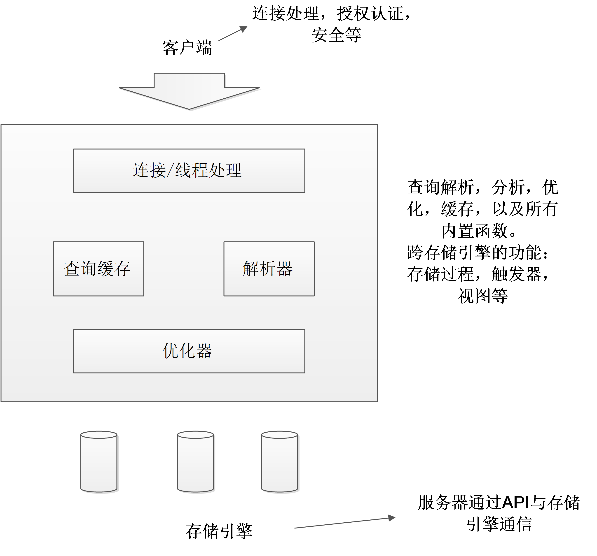

## mysql逻辑架构

## 锁粒度

* 表锁：开销最小，锁定整张表。一个用户获得写锁后，会阻塞其他用户对该表的所有读写操作。读锁之间不相互阻塞（写锁比读锁右更高优先级）．例如ALTER TABLE之类的操作，将会锁定整张表
* 行级锁：只在存储引擎层实现

## 选择优化的数据类型

* 更小的通常越好（占用更少的磁盘，内存和CPU缓存，并且处理时需要的cpu周期也更小）
* 简单就好
* 避免使用NULL。（当可为NULL时的列被索引时，每个索引记录需要一个额外的字节）
* 整形－>可以考虑使用BIGINT代替DECIMAL（乘以小数位数对应的倍数），避免浮点存储计算不精确和DECIMAL计算代价高
* 字符串：char适合短，接近定长，例如md5，不易产生碎片
* 使用枚举代替字符串类型
* 整数通常是标识列最好的选择

## 陷阱

* 太多列
* 太多关联
* 全能的枚举
* 变相枚举

# 索引

## B-Tree索引
> 索引对多个值进行排序的依据是create table语句中定义索引时列的排序
### 索引有效时
* 全值匹配
* 匹配最左前缀（只使用索引第一列）
* 匹配列前缀（匹配某一列的值的开头部分）
* 匹配范围值
* 精确匹配某一列并范围匹配另外一列
* 只访问索引的查询
### 限制
* 如果不是按照索引的最左列开始查找，则无法使用索引
* 不能跳过索引中的列
* 如果查询中有某个列的范围查询，则其右边所有列都无法使用索引优化查找

## 哈希索引（只要精确匹配索引才有效）
* 哈希索引只包含哈希值和行指针，不存储字段值，但访问内存中的行速度很快
* 哈希索引数据不是按照数据值排序，因此无法用于排序
* 哈希索引不支持部分索引列匹配查找
* 哈希索引只支持等值比较查询，不支持任何范围查询
* 访问哈希索引的数据非常快，除非有很多哈希冲突（将会一个一个遍历）
* 如果哈希冲突很多的话，一些索引维护操作的代价会很高

## 创建自定义哈希索引

## 空间数据索引（R-Tree）

## 全文索引

## 其他索引类别

索引优点
* 大大减少了服务器需要扫描的数据量
* 可以帮助服务器避免排序和创建临时表
* 可以将随机I/O变为顺序I/O

索引策略
* 独立的列：查询时索引列不能是表达式的一部分
* 前缀索引和索引的选择性（减少索引大小和维护开销）
* 多列索引
* 选择合适索引列顺序（选择性多的在前）

## 聚簇索引（一个表只能有一个）
优点：
* 可以把相关的数据保存在一起（电子邮箱，全部邮件）
* 数据访问更快（索引和数据保存在同一个B-Tree）
* 使用覆盖索引扫描的查询可以直接使用页节点中的主键值
缺点：
* 聚簇数据最大限度地提高了I/O密集型应用的性能，但如果数据全部都放在内存中，则访问的顺序就没那么重要了，聚簇索引的优势就没了
* 插入速度严重依赖于插入排序
* 更新聚簇索引列的代价很高
* 基于聚簇索引的表在插入新行，或主键被更新导致需要移动行的时候，可能面临“页分页”问题，页分裂会导致表占用更多磁盘空间
* 聚簇索引可能导致全表扫描变慢，尤其是行比较稀疏或者由于页分裂导致数据存储不连续的时候
* 二级索引（非聚簇索引）可能比想象的要更大，因为在二级索引的叶子节点包含了引用行的主键列
* 二级索引访问需要两次索引查找，而不是一次（存储引擎需要找到二级索引的叶子节点获得对应的主键值然后根据这个值去聚簇索引中查找对应的行）

## 覆盖索引
* mysql只能用B-Tree索引做覆盖索引（必须要存储索引列的值）

可以使用“延迟关联”来优化对列的查询

## 使用索引扫描来做排序
只有当索引的列顺序和order by的自居的顺序完全一致，并且所有列的排序方向都一样时，mysql才能够使用索引来对结果做排序

## 压缩（前缀压缩）索引
* 减少索引大小（某些操作可能变慢）

## 冗余和重复索引
* 重复索引：相同列上按照相同顺序创建相同的类型索引，应该避免
* 冗余索引：索引（A,B）可以当成索引（A）使用，不能当（B）

## 未使用的索引

索引可以让查询锁定更少的行
