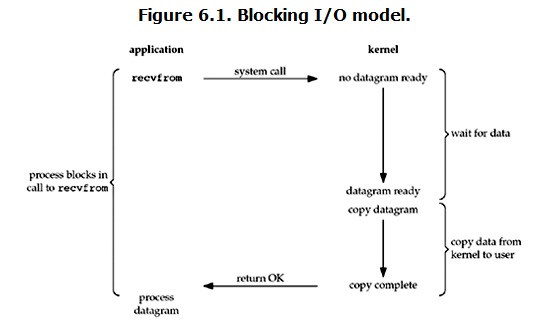
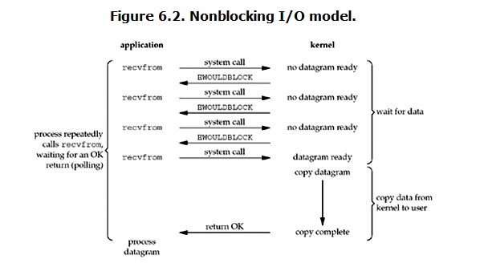

# I/O模式
* 阻塞I/O(Blocking IO)
* 非阻塞I/O(noblocking IO)
* I/O多路复用(IO multiplexing)
* 信号驱动I/O（signal driven IO）
* 异步I/O（asynchronous IO）

## 阻塞I/O(Blocking IO)
linux下的socket默认是阻塞IO，如下图

当用户进程调用recvfrom这个系统调用，kernel就开始了IO的第一个阶段：准备数据。这个过程需要等待，也就是说数据被拷贝到操作系统内核的缓冲区中是需要一个过程的。而在用户进程这边，整个进程会被阻塞。当kernel一直等到数据准备好了，它就会将数据从kernel中拷贝到用户内存，然后kernel返回结果，用户进程才解锁block状态，重新运行起来。
* 所以，阻塞I/O的特点就是在IO执行的两个阶段都被Block了

## 非阻塞I/O(noblocking IO)
linux下，可以通过设置socket使其变为non-blocking。当对一个non-blocking socket执行读操作时，流程是这样
   
当用户发出read操作时，如果kernel中的数据还没准备好，那么它病不会block用户进程，而是返回error。对于用户进程来说，它发起一个read操作后，并不需要等待，而是马上得到结果。用户进程判断结果是一个error时，就知道数据还没准备好，于是它可以再次发送read操作。一旦kernel中的数据准备好了，并且又再次收到了用户进程的system call，那么它马上就将数据拷贝到了用户内存，然后返回。
* 非阻塞I/O的特点是用户进程需要不断主动询问kernel数据准备好了没有

参考
[Linux IO模式及 select、poll、epoll详解](https://segmentfault.com/a/1190000003063859)