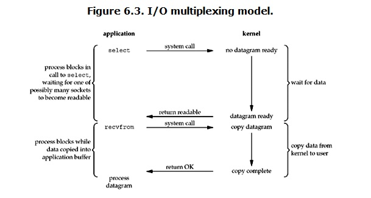
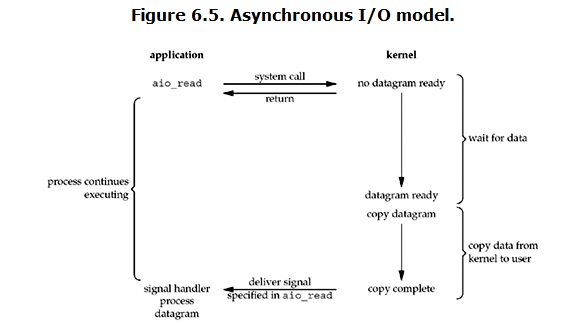
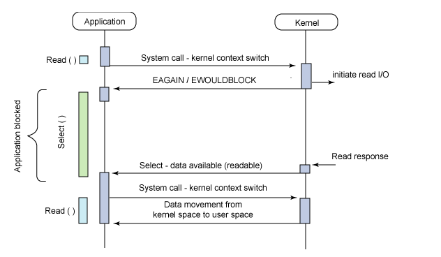

# I/O模式
* 阻塞I/O(Blocking IO)
* 非阻塞I/O(noblocking IO)
* I/O多路复用(IO multiplexing)
* 信号驱动I/O（signal driven IO）
* 异步I/O（asynchronous IO）

## 阻塞I/O(Blocking IO)
linux下的socket默认是阻塞IO，如下图  
  
当用户进程调用recvfrom这个系统调用，kernel就开始了IO的第一个阶段：准备数据。这个过程需要等待，也就是说数据被拷贝到操作系统内核的缓冲区中是需要一个过程的。而在用户进程这边，整个进程会被阻塞。当kernel一直等到数据准备好了，它就会将数据从kernel中拷贝到用户内存，然后kernel返回结果，用户进程才解锁block状态，重新运行起来。
* 所以，阻塞I/O的特点就是在IO执行的两个阶段都被Block了

## 非阻塞I/O(noblocking IO)
linux下，可以通过设置socket使其变为non-blocking。当对一个non-blocking socket执行读操作时，流程是这样  
   
当用户发出read操作时，如果kernel中的数据还没准备好，那么它病不会block用户进程，而是返回error。对于用户进程来说，它发起一个read操作后，并不需要等待，而是马上得到结果。用户进程判断结果是一个error时，就知道数据还没准备好，于是它可以再次发送read操作。一旦kernel中的数据准备好了，并且又再次收到了用户进程的system call，那么它马上就将数据拷贝到了用户内存，然后返回。
* 非阻塞I/O的特点是用户进程需要不断主动询问kernel数据准备好了没有

## I/O多路复用(IO multiplexing)
就是我们所说的select，poll，epoll。其好处就是单个process可以同时处理多个网络连接的IO。它的基本原理就是select，poll，epoll这些function会不断轮训所负责的所有socket，当某个socket所有数据到达了，就通知用户进程。  
  
当用户进程调用了select，那么整个进程就会被block，同时，kernel会“监视”所有select负责的socket，当任何一个soclet中的数据准备好了，select就会返回。这个时候用户进程再调用read操作，将数据从kernel拷贝到用于进程。
* I/O多路复用的特点是通过一种机制一个进程能同时等待多个文件描述符，而这些文件描述符（套接字描述符）其中的任何一个进入读就绪状态，select()函数就可以返回。
* 如果处理的连接数不是很高的话，使用select/epoll的web server不一定比使用多线程+阻塞I/O的web server性能好，可能延迟还更大。select/epoll的优势并不是对单个连接能处理得更快，而是在于能处理更多的连接。
* 实际中，对于每个socket，一般都设置成为non-blocking，不过整个process是被select这个函数block，而不是被socket IO给block。


## 异步I/O(asynchronous IO)
linux下使用asynchronous IO其实使用得很少  
  
当用户进程发起read操作后，立刻就可以开始去做其他的事。而另一方面，从kernel的角度，当它收到一个asynchronous read后，它会立刻返回，所以不会对用户进程产生任何block。然后，kernel会等待数据准备完成，然后将数据拷贝到用户内存，当这一切都完成之后，kernel会给用户进程发送一个signal，告诉它read操作完成了。

* 阻塞I/O，非阻塞I/O，I/O多路复用属于同步IO

# select,poll,epoll
## select
```c++
int select (int n, fd_set *readfds, fd_set *writefds, fd_set *exceptfds, struct timeval *timeout);
```

1. 使用copy_from_user从用户空间拷贝fd_set到内核空间
2. 注册回调函数__pollwait
3. 遍历所有fd，调用其对应的poll方法
4. __pollwait的主要工作就是把current进程挂到设备的等待队列中，不同的设备有不同的等待队列。在设备收到一条消息（网络设备）或填写完文件数据（磁盘设备）后，会唤醒设备等待队列上睡眠的进程，这时current便被唤醒了。
5. poll方法返回时会返回一个描述读写操作是否就绪的mask掩码，根据这个mask掩码给fd_set赋值。
6. 如果遍历完所有的fd，还没有返回一个可读写的mask掩码，则会调用schedule_timeout使调用select的进程进入睡眠。当设备驱动发生自身资源可读写后，会唤醒其等待队列上睡眠的进程。如果超过一定的超时时间，还是没人唤醒，则调用select的进程会重新被唤醒获得cpu，进而重新遍历fd，判断有没有就绪的fd。
7. 把fd_set从内核空间拷贝到用户空间  

缺点
* 每次调用select，都需要把fd集合从用户态拷贝到内核态，当fd很多时开销会很大
* 同时每次调用select都需要在内核遍历传递进来的所有fd
* select支持的文件描述符数量太小，默认是1024

## poll
poll的实现跟select非常相似，只是描述fd集合的方式不同，poll使用pollfd结构而不是select的fd_set结构，其他都差不多。
```c++
int poll (struct pollfd *fds, unsigned int nfds, int timeout);
```
```c++
struct pollfd {
    int fd; /* file descriptor */
    short events; /* requested events to watch */
    short revents; /* returned events witnessed */
};
```
* pollfd结构包含了要监视的event和发生的event，不再使用select值传递的方式。同时，pollfd没有最大数量限制（但是数量过大后性能也是会下降）。和select一样，poll返回后，需要轮询pollfd来获取就绪的描述符。

## epoll


参考
* [Linux IO模式及 select、poll、epoll详解](https://segmentfault.com/a/1190000003063859)  
* [select、poll、epoll之间的区别总结整理](http://www.cnblogs.com/Anker/p/3265058.html)