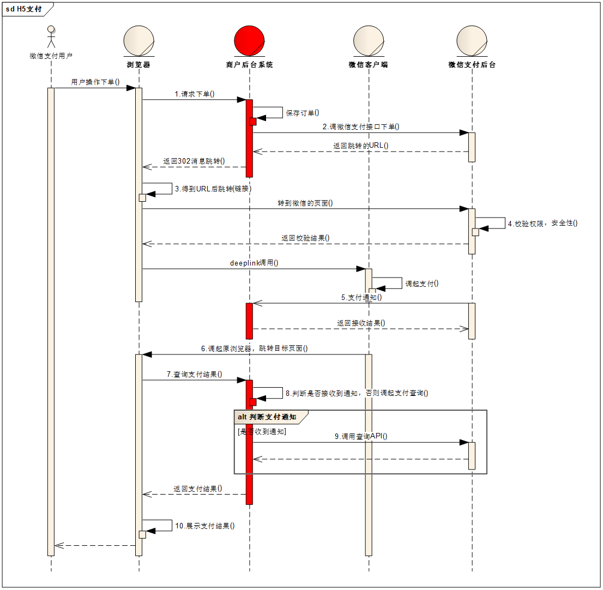

### 前言
由于学校有个项目类似轻松筹，基于微信支付，便深入了解微信支付流程及其接口调用，其业务流程有些繁琐，但其策略是不错的。   
***
### 业务流程
首先贴微信官方文档的时序图[官方文档](https://pay.weixin.qq.com/wiki/doc/api/H5.php?chapter=15_4)

#### 看不懂的可以参考我写的大概步骤如下：
1. 首先由前端发起支付请求，这时前端应该先确定好支付的金额，然后请求给后端
2. 后端收到前端的支付请求，根据自定义的订单号生成算法生成本次支付的订单号（微信要求一个商户中的所有订单号不能重复，推荐使用时间加随机数生成订单号，建议生成订单号后插入数据库，置支付状态为未支付，待后续流程再修改该订单）
3. 后端将订单号，金额，用户IP，用户OPENID，支付信息通知地址（后台服务器一个api，用于接收微信支付结果通知）等信息打包成结构体并根据签名算法对该结构体签名，签名算法参考[官方签名算法](https://pay.weixin.qq.com/wiki/doc/api/H5.php?chapter=4_3)
4. 后端将该结构体解析成xml并发给微信服务器，微信服务器将返回预订单号等信息
5. 后端收到微信发来的预订单号等信息（可以记录该信息进入数据库），将其打包并签名发送给前端，准备让前端向微信发起真正的支付请求
6. 前端调用H5接口发起请求并支付（此处由用户输入支付密码支付）
7. 支付成功后微信服务器将会通知在步骤三的通知地址，在前端的成功回调应再次发起询问后端是否收到微信的成功通知，若没有收到，则后端主动发起请求请求支付结果，并修改数据库状态

微信支付的大致流程就是这样
***
### 源码样例
下面是我开发的go源码主要业务代码  

简单统一封装post：
```go
func post(url string, data interface{}) (res_buf []byte, err error) {
	if url == "" {
		return nil, errors.New("wepay post fail: url nil")
	}
	if data == nil {
		return nil, errors.New("wepay post fail: buf nil")
	}
	buf, err := xml.Marshal(data)
	if err != nil {
		return nil, err
	}

	r, err := http.Post(url, "application/x-www-form-urlencoded", bytes.NewBuffer([]byte(buf)))
	if err != nil {
		return nil, err
	}
	res_buf, err = ioutil.ReadAll(r.Body)
	if err != nil {
		return nil, err
	}
	r.Body.Close()
	return res_buf, nil
}
```
   
统一下单请求
```go
//请求统一下单反馈结构体
type QueryRespon struct {
	ReturnCode     CDATA `xml:"return_code"`      //返回错误码
	ReturnMsg      CDATA `xml:"return_msg"`       //返回信息
	AppID          CDATA `xml:"appid"`            //公众账号ID
	MchID          CDATA `xml:"mch_id"`           //商户号
	NonceStr       CDATA `xml:"nonce_str"`        //随机字符串
	Sign           CDATA `xml:"sign"`             //签名
	ResultCode     CDATA `xml:"result_code"`      //业务结果
	ErrCode        CDATA `xml:"err_code"`         //错误代码
	ErrCodeDes     CDATA `xml:"err_code_des"`     //错误代码描述
	DeviceInfo     CDATA `xml:"device_info"`      //设备号
	OpenID         CDATA `xml:"openid"`           //用户标识
	IsSubscribe    CDATA `xml:"is_subscribe"`     //是否关注公众账号
	TradeType      CDATA `xml:"trade_type"`       //交易类型
	TradeState     CDATA `xml:"trade_state"`      //交易状态
	BankType       CDATA `xml:"bank_type"`        //付款银行
	TotalFee       int   `xml:"total_fee"`        //订单金额
	FeeType        CDATA `xml:"fee_type"`         //货币种类
	CashFee        CDATA `xml:"cash_fee"`         //现金支付金额
	CashFeeType    CDATA `xml:"cash_fee_type"`    //现金支付货币类型
	TransactionID  CDATA `xml:"transaction_id"`   //微信支付订单号
	OutTradeNO     CDATA `xml:"out_trade_no"`     //商户订单号
	Attach         CDATA `xml:"attach"`           //商家数据包
	TimeEnd        CDATA `xml:"time_end"`         //支付完成时间
	SignType       CDATA `xml:"sign_type"`        //签名类型
	TradeStateDesc CDATA `xml:"trade_state_desc"` //交易状态描述
}

//请求统一下单
func (wp *WePay) Request(out_trade_no string, fee int, client_ip string, duration int, open_id string) (*UnifiedOrderRespone, error) {

    //参数检查
	if wp.MchID == "" || wp.AppId == "" {
		return nil, errors.New("wepay request fail: mchid or appid nil")
	}
	if wp.Key == "" {
		return nil, errors.New("wepay request fail: key nil")
	}
	if out_trade_no == "" {
		return nil, errors.New("wepay request fail: out_trade_no nil")
	}
	randomStr := createNonceStr()
	if len(randomStr) != 32 {
		return nil, errors.New("wepay request fail: random str error")
	}
	if fee <= 0 {
		return nil, errors.New("wepay request fail: fee smaller than 0")
	}
	if duration <= 0 {
		return nil, errors.New("wepay request fail: duration smaller than 0")
	}
	if client_ip == "" {
		return nil, errors.New("wepay request fail: client_ip nil")
	}
	if open_id == "" {
		return nil, errors.New("wepay request fail: open_id nil")
	}

    //生成请求结构体
	request := &UnifiedOrderRequest{
		AppID:          wp.AppId,
		MchID:          wp.MchID,
		DeviceInfo:     "DeviceInfo",
		NonceStr:       randomStr,
		Sign:           "Sign",
		SignType:       "MD5",
		Body:           "XXX捐赠基金会",
		Attach:         "",
		OutTradeNo:     out_trade_no,
		FeeType:        "CNY",
		TotalFee:       fee,
		SpbillCreateIP: client_ip,
		TimeStart:      time.Now().Format("20060102150405"),
		TimeExpire:     time.Now().Add(time.Minute * time.Duration(duration)).Format("20060102150405"),
		NotifyUrl:      wp.NotifyUrl,
		TradeType:      "JSAPI",
		OpenID:         open_id,
	}

    //签名
	var err error
	err = request.SignUp(wp.Key)
	if err != nil {
		return nil, err
	}

    //转成xml并发给微信服务器
	buf, err := post(wp.UnifiedOrderUrl, request)
	if err != nil {
		return nil, err
	}

    //解析反馈
	respon := &UnifiedOrderRespone{}
	err = xml.Unmarshal(buf, respon)
	if err != nil {
		return nil, err
	}

	return respon, nil
}
```

统一下单并生成前端需要的参数并签名
```go
func (wp *WePay) WebRequest(out_trade_no string, fee int, client_ip string, duration int, open_id string) (*WebRequest, string, error) {

	if wp.Key == "" {
		return nil, "", errors.New("web request fail: key nil")
	}

	res, err := wp.Request(out_trade_no, fee, client_ip, duration, open_id)
	if err != nil {
		return nil, "", err
	}

	if res.ReturnCode.Text != "SUCCESS" || res.ResultCode.Text != "SUCCESS" {
		return nil, "", errors.New("web request fail:" + res.ErrCodeDes.Text)
	}

	webres := &WebRequest{
		AppID:     wp.AppId,
		TimeStamp: strconv.FormatInt(time.Now().Unix(), 10),
		NonceStr:  createNonceStr(),
		Package:   "prepay_id=" + res.PrepayID.Text,
		SignType:  "MD5",
	}

	err = webres.SignUp(wp.Key)
	if err != nil {
		return nil, "", err
	}

	return webres, res.PrepayID.Text, nil
}
```

查询订单
```go
type QueryRespon struct {
	ReturnCode     CDATA `xml:"return_code"`      //返回错误码
	ReturnMsg      CDATA `xml:"return_msg"`       //返回信息
	AppID          CDATA `xml:"appid"`            //公众账号ID
	MchID          CDATA `xml:"mch_id"`           //商户号
	NonceStr       CDATA `xml:"nonce_str"`        //随机字符串
	Sign           CDATA `xml:"sign"`             //签名
	ResultCode     CDATA `xml:"result_code"`      //业务结果
	ErrCode        CDATA `xml:"err_code"`         //错误代码
	ErrCodeDes     CDATA `xml:"err_code_des"`     //错误代码描述
	DeviceInfo     CDATA `xml:"device_info"`      //设备号
	OpenID         CDATA `xml:"openid"`           //用户标识
	IsSubscribe    CDATA `xml:"is_subscribe"`     //是否关注公众账号
	TradeType      CDATA `xml:"trade_type"`       //交易类型
	TradeState     CDATA `xml:"trade_state"`      //交易状态
	BankType       CDATA `xml:"bank_type"`        //付款银行
	TotalFee       int   `xml:"total_fee"`        //订单金额
	FeeType        CDATA `xml:"fee_type"`         //货币种类
	CashFee        CDATA `xml:"cash_fee"`         //现金支付金额
	CashFeeType    CDATA `xml:"cash_fee_type"`    //现金支付货币类型
	TransactionID  CDATA `xml:"transaction_id"`   //微信支付订单号
	OutTradeNO     CDATA `xml:"out_trade_no"`     //商户订单号
	Attach         CDATA `xml:"attach"`           //商家数据包
	TimeEnd        CDATA `xml:"time_end"`         //支付完成时间
	SignType       CDATA `xml:"sign_type"`        //签名类型
	TradeStateDesc CDATA `xml:"trade_state_desc"` //交易状态描述
}

//查询订单
func (wp *WePay) Query(out_trade_no string) (res *QueryRespon, err error) {

	if wp.MchID == "" || wp.AppId == "" {
		return nil, errors.New("wepay query fail: mchid or appid nil")
	}
	if out_trade_no == "" {
		return nil, errors.New("wepay query fail: out_trade_no nil")
	}

	randomStr := createNonceStr()
	if len(randomStr) != 32 {
		return nil, errors.New("wepay query fail: random str error")
	}

	q := &QueryRequest{
		AppID:      wp.AppId,
		MchID:      wp.MchID,
		OutTradeNo: out_trade_no,
		NonceStr:   randomStr,
		SignType:   "MD5",
	}

	err = q.SignUp(wp.Key)
	if err != nil {
		return nil, errors.New("wepay query fail: " + err.Error())
	}

	respon, err := post(wp.OrderQueryUrl, q)
	if err != nil {
		return nil, err
	}
	logger.Info("查询订单：" + string(respon))

	queryRespon := &QueryRespon{}
	err = xml.Unmarshal(respon, &queryRespon)
	if err != nil {
		return nil, err
	}

	return queryRespon, nil
}
```