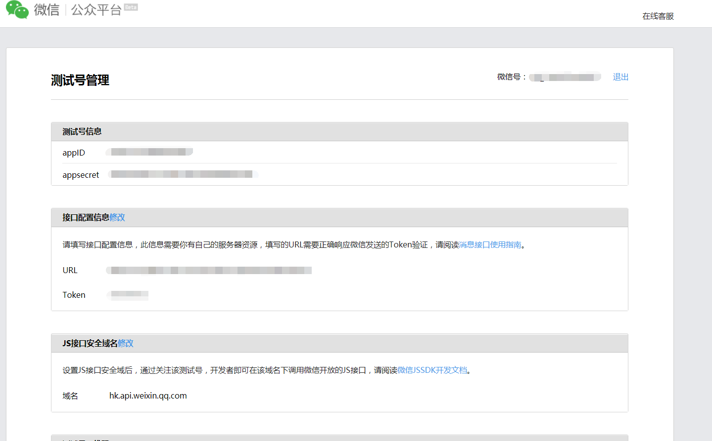
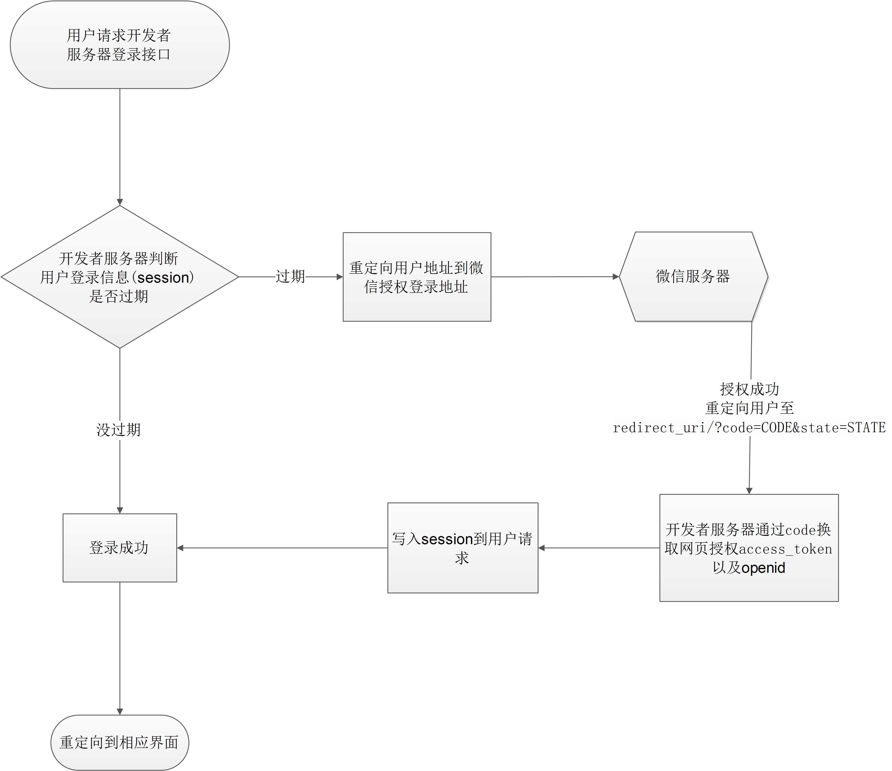

* 本文基于之前几个项目在部署在微信公众号下的网页应用，以此写下微信公众号开发的步骤以及踩过的坑
## 申请测试公众号
* 首先开发者可以在微信测试平台申请测试公众号[微信测试号申请](http://mp.weixin.qq.com/debug/cgi-bin/sandbox?t=sandbox/login)
进入如下的界面
``` appid相当于公众号的为唯一标识，appsecret相当于公众号的密码，用于获取access_token等（access_token可以用于推送模板消息等）```
* 得到服务号后要部署到服务器上需要验证服务器验证（接口配置信息的URL，其中URL将作为后期微信公众号事件推送的地址，包括用户点击公众号按钮事件，获取用户地理位置事件，都是由这个接口接收微信通知的），验证规定使用80或443端口
* 如果是本地主机测试没有域名可以使用[natapp](https://natapp.cn/)进行内网映射
* 填写服务器地址URL(可以使用主机域名)、Token(这里的token自定义，区别与之后的access_token)
* 开发者提交信息后，微信服务器将发送GET请求到填写的服务器地址URL上，GET请求携带参数如下表所示：  

| 参数        | 描述                                       |  
| --------- | ---------------------------------------- |
| signature | 微信加密签名，signature结合了开发者填写的token参数和请求中的>> timestamp参数、nonce参数。 |
| timestamp | 时间戳                                      |
| nonce     | 随机数                                      |
| echostr   | 随机字符串                                    |
若确认此次GET请求来自微信服务器，请原样返回echostr参数内容，则接入生效，成为开发者成功，否则接入失败。加密/校验流程如下：
> 1. 将token、timestamp、nonce三个参数进行字典序排序 
> 2. 将三个参数字符串拼接成一个字符串进行sha1加密 3）开发者获得加密后的字符串可与signature对比，标识该请求来源于微信

参考go语言
```go
package main

import (
        "crypto/sha1"
        "fmt"
        "io"
        "log"
        "net/http"
        "sort"
        "strings"
)

const (
        token = "wechat"
)

func makeSignature(timestamp, nonce string) string {
        sl := []string{token, timestamp, nonce}
        sort.Strings(sl)
        s := sha1.New()
        io.WriteString(s, strings.Join(sl, ""))
        return fmt.Sprintf("%x", s.Sum(nil))
}

func validateUrl(w http.ResponseWriter, r *http.Request) bool {
        timestamp := strings.Join(r.Form["timestamp"], "")
        nonce := strings.Join(r.Form["nonce"], "")
        signatureGen := makeSignature(timestamp, nonce)

        signatureIn := strings.Join(r.Form["signature"], "")
        if signatureGen != signatureIn {
                return false
        }
        echostr := strings.Join(r.Form["echostr"], "")
        fmt.Fprintf(w, echostr)
        return true
}

func procRequest(w http.ResponseWriter, r *http.Request) {
        r.ParseForm()
        if !validateUrl(w, r) {
                log.Println("Wechat Service: this http request is not from Wechat platform!")
                return
        }
        log.Println("Wechat Service: validateUrl Ok!")
}

func main() {
        log.Println("Wechat Service: Start!")
        http.HandleFunc("/", procRequest)
        err := http.ListenAndServe(":80", nil)
        if err != nil {
                log.Fatal("Wechat Service: ListenAndServe failed, ", err)
        }
        log.Println("Wechat Service: Stop!")
}
```
注意微信服务器填写的URL中的域名api对应代码的api

----
### 公众号授权登录
##### 关于网页授权的两种scope的区别说明
> 1. 以snsapi_base为scope发起的网页授权，是用来获取进入页面的用户的openid的，并且是静默授权并自动跳转到回调页的。用户感知的就是直接进入了回调页（往往是业务页面）
> 2.以snsapi_userinfo为scope发起的网页授权，是用来获取用户的基本信息的。但这种授权需要用户手动同意，并且由于用户同意过，所以无须关注，就可在授权后获取该用户的基本信息。
> 3. 用户管理类接口中的“获取用户基本信息接口”，是在用户和公众号产生消息交互或关注后事件推送后，才能根据用户OpenID来获取用户基本信息。这个接口，包括其他微信接口，都是需要该用户（即openid）关注了公众号后，才能调用成功的。

注： 
> * **一个用户经过微信snsapi_base授权登录后，微信服务器会返回用户的唯一标识openid，该openid在本公众号中具有唯一性，但不同公众号同一用户拥有不同的openid**
> * **开发者如果需要跨公众号识别同一用户，可以使用snsapi_userinfo方法拉取用户的UnionID**

##### snsapi_base方法授权解释
> **遵循规则：**
> 1、在微信公众号请求用户网页授权之前，开发者需要先到公众平台官网中的“开发 - 接口权限 - 网页服务 - 网页帐号 - 网页授权获取用户基本信息”的配置选项中，修改授权回调域名。请注意，这里填写的是域名（是一个字符串），而不是URL，因此请勿加 http:// 等协议头，例如：gzhu.edu.cn；
> 2、授权回调域名配置规范为全域名，比如需要网页授权的域名为：www.qq.com，配置以后此域名下面的页面[http://www.qq.com/music.html](http://www.qq.com/music.html) 、 [http://www.qq.com/login.html](http://www.qq.com/login.html) 都可以进行OAuth2.0鉴权。但[http://pay.qq.com](http://pay.qq.com/) 、 [http://music.qq.com](http://music.qq.com/) 、 [http://qq.com无法进行OAuth2.0鉴权](http://qq.xn--comoauth2-735sh62dwk9eysua.xn--0-k76bu98j/)

授权登录流程：

开发者开发时最好先判断用户信息是否过期，过期再重定向用户至微信授权登录
授权登录go演示代码
```go
func AuthLogin(w http.ResponseWriter, r *http.Request) {

	title := "登录"

	if r.Method != "GET" {
		responHtml(w, title, "请求方式错误!")
		return
	}

	err:=r.ParseForm()
	if err!=nil{
		wc.logger.Error(fmt.Errorf("auth login fail: %v",err))
		responHtml(w, title, "系统错误")
		return
	}


	route := r.FormValue("route")
	if route == "" {
		wc.logger.Warning("auth login fail: route is nil")
		responHtml(w, title, "路由为空")
		return
	}

	sess,err := wc.CheckSession(r)
	if err!=nil{
		wc.logger.Error(fmt.Errorf("auth login fail: %v",err))
		responHtml(w, title, "系统错误")
		return
	}

	if sess==nil {
		wc.logger.Info("授权登陆：cookie 过期，重新授权")
		url := wc.conf.UserOAuthUrl + "appid=" + wc.conf.AppID + "&redirect_uri=" + wc.conf.ServerHost+wc.conf.ServerGrantAPI +
			"&response_type=code&scope=snsapi_base&state=" + route + "#wechat_redirect"
		http.Redirect(w, r, url, 302)
		return
	}else {
		if wc.route[route] == "" {
			wc.logger.Warning(fmt.Errorf("auth login fail: route %s doesn't exist ", route))
			responHtml(w, title, "路由 "+route+" 不存在")
			return
		}

		redirectUrl:=wc.conf.ServerHost+wc.route[route]
		wc.logger.Info(fmt.Sprintf("授权登陆成功：用户：%s 重定向至 %s",sess.UserID,redirectUrl))
		http.Redirect(w, r, redirectUrl, 302)
		return
	}
}

//微信授权
func WechatGrant(w http.ResponseWriter, r *http.Request) {
	title := "授权"

	r.ParseForm()
	code := r.FormValue("code")
	state := r.FormValue("state")

	if len(code) == 0 {
		wc.logger.Warning("wechat grant fail: code is invalid")
		responHtml(w, title, "code is invalid")
		return
	}
	if state == "" {
		wc.logger.Warning("wechat grant fail: state is invalid")
		responHtml(w, title, "state is invalid")
		return
	}

	var data *http.Response
	var err error
	url := wc.conf.GetOpenIDUrl + "appid=" + wc.conf.AppID + "&secret=" + wc.conf.AppSecret +
		"&code=" + code + "&grant_type=authorization_code"

	wc.logger.Info("微信授权：获取用户信息链接：" + url)

	data, err = http.Get(url)
	if err != nil {
		wc.logger.Error(fmt.Errorf("wechat grant fail: %v", err))
		responHtml(w, title, "系统错误")
		return
	}

	body, err := ioutil.ReadAll(data.Body)
	defer data.Body.Close()
	if err != nil {
		wc.logger.Error(fmt.Errorf("wechat grant fail: %v", err))
		responHtml(w, title, "系统错误")
		return
	}

	userGrantInfo := &userGrantInfo{}
	err = json.Unmarshal(body, userGrantInfo)
	if err != nil {
		wc.logger.Error(fmt.Errorf("wechat grant fail: %v", err))
		responHtml(w, title, "系统错误")
		return
	}

	if len(userGrantInfo.OpenID) == 0 {
		wc.logger.Error("wechat grant fail: openid nil")
		responHtml(w, title, "openid 为空")
		return
	}

	err = wc.GrantCallBack(w, r, userGrantInfo.OpenID)
	if err != nil {
		wc.logger.Error(fmt.Errorf("wechat grant fail: %v", err))
		responHtml(w, title, "系统错误")
		return
	}

	if wc.route[state] == "" {
		wc.logger.Warning(fmt.Errorf("wechat grant fail: route %s doesn't exist", state))
		responHtml(w, title, "路由错误："+state)
		return
	}

	wc.logger.Info("微信授权：用户%s登录成功，重定向至%s",userGrantInfo.OpenID,wc.conf.ServerHost+wc.route[state])

	http.Redirect(w, r, wc.conf.ServerHost+wc.route[state], 302)

}
```
----
### 微信assess_token管理
access_token的有效期目前为2个小时，需定时刷新，**重复获取将导致上次获取的access_token失效**，所以微信assess_token再服务器端应该有一个统一管理的模块

微信官方文档表述：
> 1、建议公众号开发者使用中控服务器统一获取和刷新Access_token，其他业务逻辑服务器所使用的access_token均来自于该中控服务器，不应该各自去刷新，否则容易造成冲突，导致access_token覆盖而影响业务；
> 2、目前Access_token的有效期通过返回的expire_in来传达，目前是7200秒之内的值。中控服务器需要根据这个有效时间提前去刷新新access_token。在刷新过程中，中控服务器可对外继续输出的老access_token，此时公众平台后台会保证在5分钟内，新老access_token都可用，这保证了第三方业务的平滑过渡；
> 3、Access_token的有效时间可能会在未来有调整，所以中控服务器不仅需要内部定时主动刷新，还需要提供被动刷新access_token的接口，这样便于业务服务器在API调用获知access_token已超时的情况下，可以触发access_token的刷新流程。

获取接口调用请求说明
https请求方式: GET
https://api.weixin.qq.com/cgi-bin/token?grant_type=client_credential&appid=APPID&secret=APPSECRET
参数说明
| 参数         | 是否必须 | 说明                                |
| ---------- | ---- | --------------------------------- |
| grant_type | 是    | 获取access_token填写client_credential |
| appid      | 是    | 第三方用户唯一凭证                         |
| secret     | 是    | 第三方用户唯一凭证密钥，即appsecret            |

返回说明
正常情况下，微信会返回下述JSON数据包给公众号：
{"access_token":"ACCESS_TOKEN","expires_in":7200}
| 参数| 说明 |
| ---- | ---- |
| access_token	| 获取到的凭证 |
| expires_in	| 凭证有效时间，单位：秒
错误时微信会返回错误码等信息，JSON数据包示例如下（该示例为AppID无效错误）: |

{"errcode":40013,"errmsg":"invalid appid"}
返回码说明
| 返回码	| 说明|
| ---- | ---- |
| -1	| 系统繁忙，此时请开发者稍候再试|
| 0	| 请求成功|
| 40001	| AppSecret错误或者AppSecret不属于这个公众号，请开发者确认AppSecret的正确性|
| 40002	| 请确保grant_type字段值为client_credential|
| 40164	| 调用接口的IP地址不在白名单中，请在接口IP白名单中进行设置|

注意，在生产环境中，access_token的获取需要在微信公众号后台设置服务器的IP地址，如果请求access_token的源IP不在微信公众号配置的ip白名单中，将会获取失败，因此保险起见要**配置服务器对外IP所有可变情况**，因为曾经微信服务器检测到我们学校的服务器是会跳动的（实际上我们的服务器对外IP不变）
